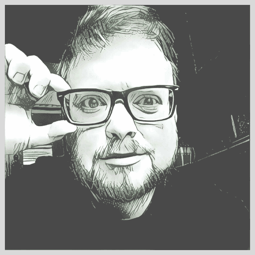

I am a highly motivated and creative Firmware Engineer with a proven record of strong technical development in a range of areas.

I like to code in C and C++ and am comfortable scripting in Python.

I have experience working in a range of environments:

 - 8, 16 & 32 bit MCU's (SI Labs 8051/Freescale S12X/ARM Cortex M3)
 - IAR Embedded Workbench on Windows & GCC/GDB and Make in Linux / OS X
 - Particle's Photon Platform (Cortex M3 core)
 - Git and SVN

I've worked on a number of different projects ranging from low power industrial sensing systems, to MISRA complient automotive sensors, to low latency network middlewares, to beer brewing robots.

I am also somewhat proficient in electronic design and PCB design/manufacturing processes.

In my spare time, I like to make podcasts, ride my bike and brew beer.
